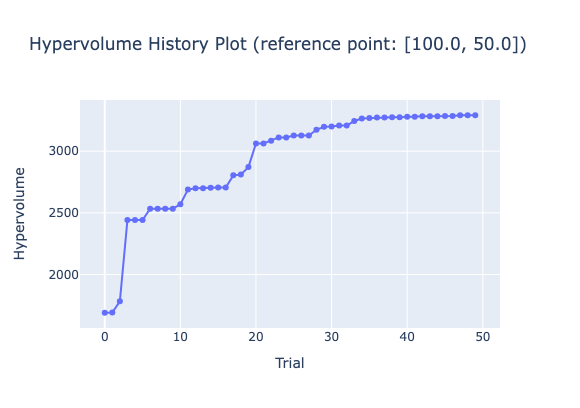

Plot Hypervolume History with Reference Point
===

This package provides a function to plot hypervolume history with the reference point information.

# plot_hypervolume_history
```python
def plot_hypervolume_history(study, reference_point) -> "go.Figure"
```

Plot hypervolume history of all trials in a study.


## Parameters
- `study (Study)` – A Study object whose trials are plotted for their hypervolumes. The number of objectives must be 2 or more.
- `reference_point (Sequence[float])` – A reference point to use for hypervolume computation. The dimension of the reference point must be the same as the number of objectives.


## Returns
- A `plotly.graph_objects.Figure` object.


## Return type
- `Figure`


# Example

The following code snippet shows how to plot optimization history.


```python
import optuna
import optunahub


def objective(trial):
    x = trial.suggest_float("x", 0, 5)
    y = trial.suggest_float("y", 0, 3)

    v0 = 4 * x ** 2 + 4 * y ** 2
    v1 = (x - 5) ** 2 + (y - 5) ** 2
    return v0, v1


if __name__ == "__main__":
    mod = optunahub.load("visualization/plot_hypervolume_history_with_rp")

    study = optuna.create_study(directions=["minimize", "minimize"])
    study.optimize(objective, n_trials=50)

    reference_point=[100., 50.]
    fig = mod.plot_hypervolume_history(study, reference_point)
    fig.show()
```




# Author Information

This package is contributed by [Optuna team](https://github.com/orgs/optuna/people).
